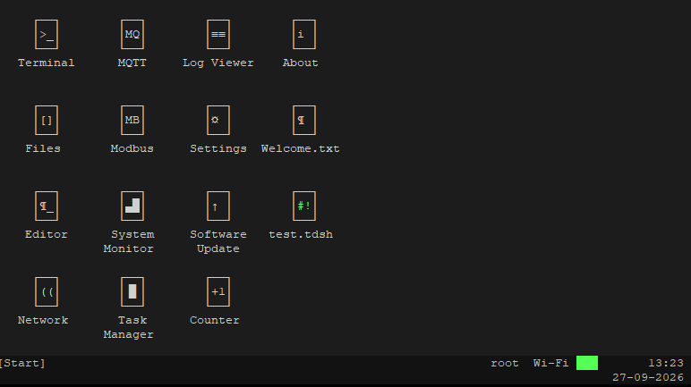
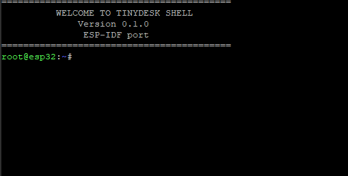

# TinyDesk <small>Developer preview</small>

> An ESP32. A terminal. A desktop you can drag windows around.

  <figure>
    
    <figcaption><b>TinyDesk Desktop</b>: windows, apps and a mouse in a compatible terminal</figcaption>
  </figure>
  <figure>
    
    <figcaption><b>TinyDesk Shell</b>: the same shell on its own, on a serial console</figcaption>
  </figure>

- Windows, taskbar, start menu, mouse, and a real shell
- Open Files, edit and save text, then run a command in Terminal
- Connect a real project with MQTT or Modbus
- Use a UTF-8 terminal with ANSI/VT cursor control and xterm mouse reporting
- Remote access is opt-in after changing the factory root password
- Portable C11 core with a four-function port layer: ports for ESP32-C6, ESP32, Linux and Windows
- TinyDesk Shell: the same shell as an app on the desktop, or on its own

[Install](/guide/install.md)
[Get started](/guide/getting-started.md)
[GitHub](https://github.com/schikani/tinydesk)
